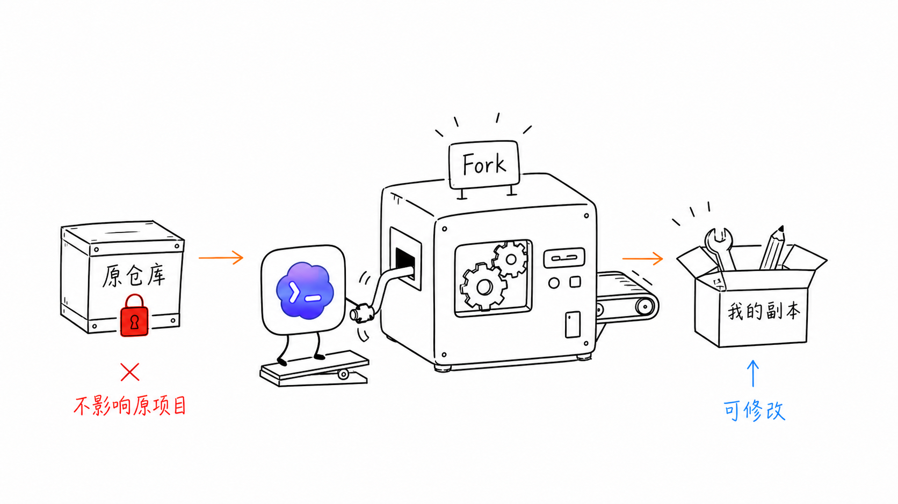
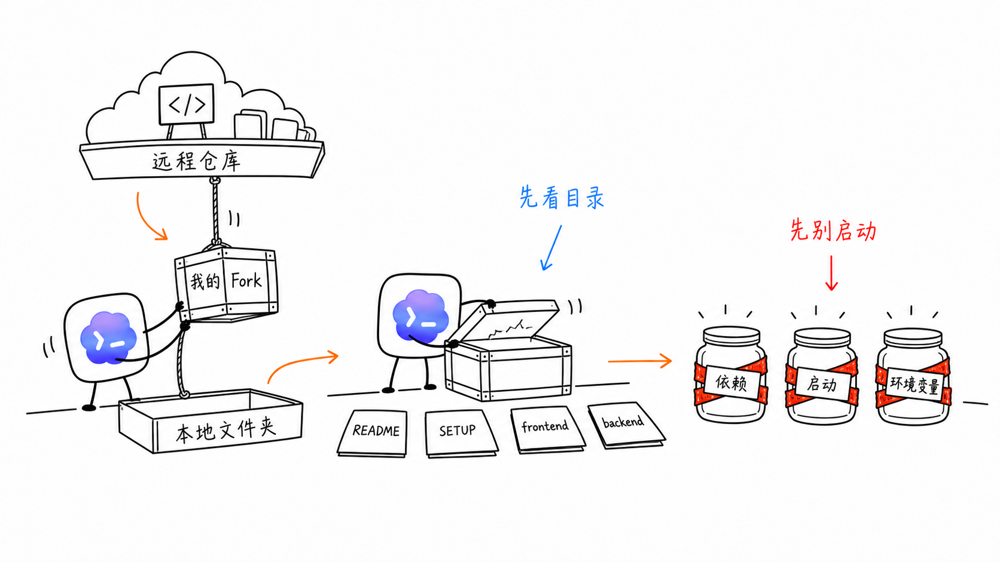
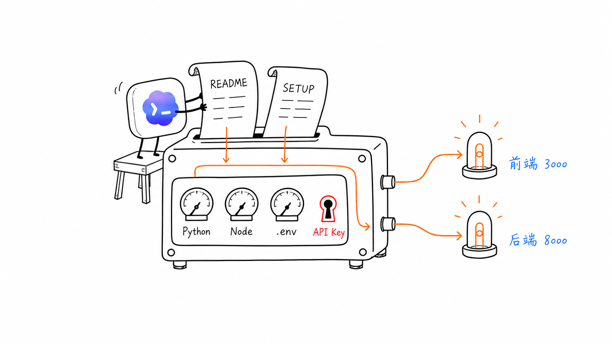

# Codex App Icon Illustrations

> 把中文课程文档里的判断、流程、状态和隐喻，变成一张张白底、手绘、清爽的正文配图。
>
> 16:9 横版 | Codex App 图标角色 | 纯白手绘 | 少量红橙蓝中文批注 | Codex Skill

---

## 这个仓库是什么

这是基于 [helloianneo/ian-xiaohei-illustrations](https://github.com/helloianneo/ian-xiaohei-illustrations) 改造的 Codex Skill 派生版本。

原项目使用“小黑”作为固定视觉角色；这个 fork 改为使用“Codex App 图标角色”：白色圆角方块、蓝紫云朵、`>_` 命令符号。它更适合放在 Codex 桌面 App 教程、开源项目阅读课程和 AI 编程实战资料里。

它不是通用插画提示词，也不是 PPT 信息图模板。它的核心目标是：先理解文章里的认知锚点，再把其中一个判断、流程、结构、状态或隐喻，变成一张有记忆点的 16:9 手绘解释图。

---

## 适合谁用

特别适合：

- 写中文课程文档，需要正文配图的人。
- 做 Codex、AI 编程、开源项目阅读、工作流教学内容的人。
- 想把抽象判断画成具体隐喻的人。
- 想要一种比 PPT 信息图更轻、更有趣、更贴近 Codex 主题的配图风格的人。

不适合：

- 想要商业插画、品牌 KV 或精致扁平插画的人。
- 想要传统 PPT 信息图、复杂架构图或流程图的人。
- 想要儿童卡通、表情包风格的人。
- 想把大量正文、长段解释或完整课程页塞进一张图里的人。
- 需要严格可编辑矢量源文件的人。

---

## 它会产出什么

默认输出：

- 16:9 横版正文配图。
- 一篇文章的 4-8 张配图清单。
- 每张图的主题、核心意思、结构类型、角色动作和中文标注建议。
- 最终 PNG 图片，保存到 workspace 的 `assets/<article-slug>-illustrations/`。

默认不输出：

- PPTX / PDF / Keynote。
- SVG / HTML / Canvas 可编辑图。
- 商业海报或封面。
- 大段文字型信息图。

---

## 视觉风格

这个 skill 默认使用 Codex App 图标角色风格：

- 纯白背景，不要纸纹、米色、阴影、渐变。
- 黑色手绘线稿，细线，轻微抖动。
- 大量留白，主体只占画面约 40%-60%。
- 少量红色、橙色、蓝紫色中文手写批注。
- 一张图只表达一个核心动作、结构、状态或隐喻。
- Codex App 图标角色必须参与核心动作，不能只是装饰。
- 清爽、有趣，有一点低科技隐喻感，但不幼稚、不卖萌。

---

## 示例效果

### 先读架构，再动手


### Fork 成自己的副本



### 先克隆，先看目录



### 读文档后再启动



### 找到前端使用路径


### 岗位描述压进简历


### AI 改写要人工检查


### 从阅读到跑通的完整路径


这些图片是风格校准样例，不是构图模板。使用时应该从当前文章重新发明隐喻，不要照抄旧案例的物件和构图。

---

## 安装

克隆仓库：

```bash
git clone https://github.com/Orion-code22/ian-xiaohei-illustrations.git
cd ian-xiaohei-illustrations
```

复制 skill 到 Codex skills 目录：

```bash
mkdir -p "${CODEX_HOME:-$HOME/.codex}/skills"
cp -R ./codex-app-icon-illustrations "${CODEX_HOME:-$HOME/.codex}/skills/"
```

安装后，在 Codex 里使用：

```text
Use $codex-app-icon-illustrations 为这篇中文课程文档设计并生成 5 张 Codex App 图标角色正文配图。
```

---

## 怎么用

### 只做配图规划

```text
Use $codex-app-icon-illustrations 先不要生图。
请分析下面这篇文章哪里值得配图，输出 5 张左右的配图清单。
每张图写清楚：放在哪段后、主题、核心意思、结构类型、Codex App 图标角色在做什么、建议中文标注词。

<粘贴文章>
```

### 直接生成正文配图

```text
Use $codex-app-icon-illustrations 把下面这篇文章生成 4 张 Codex App 图标角色正文配图。
要求：16:9 横版、纯白背景、黑色手绘线稿、少量红橙蓝中文手写批注。

<粘贴文章>
```

### 为单个概念生成一张图

```text
Use $codex-app-icon-illustrations 为“开源项目不是先跑起来，而是先看清楚它的结构”生成一张正文配图。
画面要清爽、有趣，Codex App 图标角色必须承担核心动作。
```

更多示例见 [examples/prompts.md](examples/prompts.md)。

---

## 工作流程

这个 skill 的流程是：

1. 读取文章、Markdown、Notion 内容、截图或用户给的主题。
2. 提炼核心观点、认知转折、流程结构和适合视觉化的段落。
3. 先输出配图清单：每张图只选一个认知锚点。
4. 为每张图选择结构类型：工作流、系统局部、前后对比、角色状态、概念隐喻、方法分层、地图路线或小漫画分镜。
5. 重新发明一个低科技、奇怪但成立的物理隐喻。
6. 让 Codex App 图标角色承担核心动作。
7. 每张图单独调用图像模型生成。
8. 按检查清单检查：白底、留白、角色动作、中文标注、非 PPT 感。
9. 保存最终 PNG，并报告用途和路径。

---

## 目录结构

```text
.
├── README.md
├── LICENSE
├── NOTICE.md
├── examples/
│   ├── images/
│   │   ├── 01-read-architecture-before-running.png
│   │   ├── 02-fork-own-copy.png
│   │   └── ...
│   └── prompts.md
└── codex-app-icon-illustrations/
    ├── SKILL.md
    ├── agents/
    │   └── openai.yaml
    ├── assets/
    │   └── examples/
    └── references/
        ├── style-dna.md
        ├── codex-app-icon-character.md
        ├── composition-patterns.md
        ├── prompt-template.md
        └── qa-checklist.md
```

真正需要安装到 Codex 的是子目录：

```text
codex-app-icon-illustrations/
```

---

## 注意事项

- 图片里的中文文字越短越稳定。
- 每张图只讲一个核心结构，不要把文章做成说明书。
- Codex App 图标角色必须承担核心动作。
- 示例图只用于校准线条密度、留白、颜色克制和角色参与方式，不要复刻构图。
- AI 图像模型可能出现错字、幻觉标签、风格漂移或多余标题，生成后需要检查。
- 如果中文错字严重，优先减少标注词并重生成。

---

## 来源说明

这个仓库是 `helloianneo/ian-xiaohei-illustrations` 的 fork 派生版本，保留原项目 MIT 许可证。原项目的“小黑”视觉角色属于 Ian 的个人视觉语言；本 fork 将固定角色替换为 Codex App 图标角色，用于 Codex 课程配图场景。
